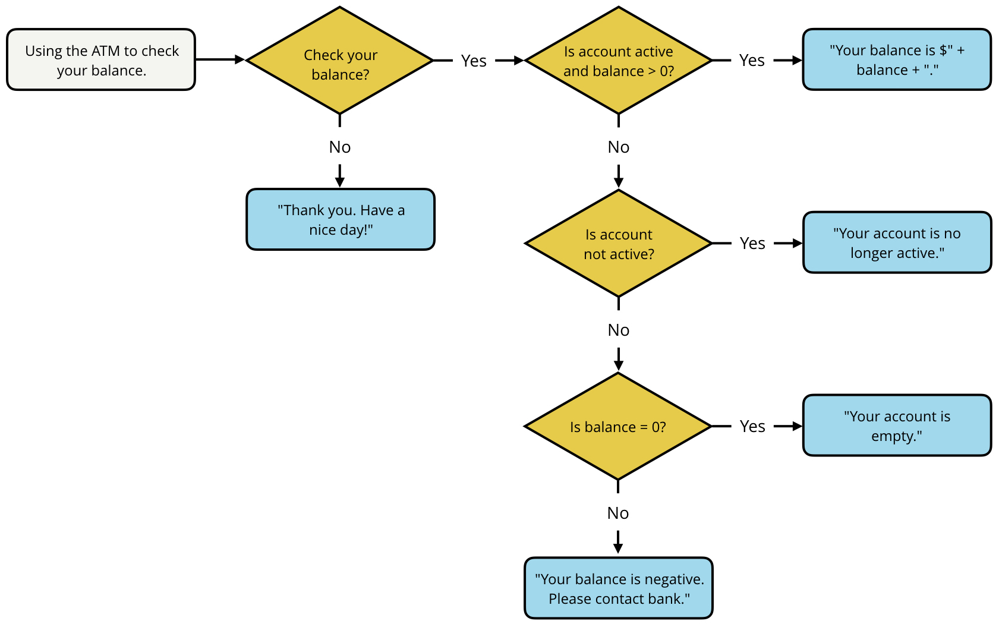

var price = 15.00; // price of hammer
var money = 20.00; // how much money i have

if(money >= price) {
	console.log("buy the hammer")
} else {
	console.log("don't buy the hammer")
}

If...else statements
If...else statements allow you to execute certain pieces of code based on a condition, or set of conditions, being met.
```
if (/* this expression is true */) {
  // run this code
} else {
  // run this code
}
```
This is extremely helpful because it allows you to choose which piece of code you want to run based on the result of an expression. For example,
```
var a = 1;
var b = 2;

if (a > b) {
  console.log("a is greater than b");
} else {
  console.log("a is less than or equal to b");
}
```

Prints: "a is less than or equal to b"
A couple of important things to notice about if...else statements.

The value inside the if statement is always converted to true or false. Depending on the value, the code inside the if statement is run or the code inside the else statement is run, but not both. The code inside the if and else statements are surrounded by curly braces {...} to separate the conditions and indicate which code should be run.

TIP: When coding, sometimes you may only want to use an if statement. However, if you try to use only an else statement, then you will receive the error SyntaxError: Unexpected token else. You’ll see this error because else statements need an if statement in order to work. You can’t have an else statement without first having an if statement.

n some situations, two conditionals aren’t enough. Consider the following situation.

You're trying to decide what to wear tomorrow. If it is going to snow, then you’ll want to wear a coat. If it's not going to snow and it's going to rain, then you’ll want to wear a jacket. And if it's not going to snow or rain, then you’ll just wear what you have on.


Else if statements
In JavaScript, you can represent this secondary check by using an extra if statement called an else if statement.

```
var weather = "sunny";

if (weather === "snow") {
  console.log("Bring a coat.");
} else if (weather === "rain") {
  console.log("Bring a rain jacket.");
} else {
  console.log("Wear what you have on.");
}
```

Prints: Wear what you have on.
By adding the extra else if statement, you're adding an extra conditional statement.

If it’s not going to snow, then the code will jump to the else if statement to see if it’s going to rain. If it’s not going to rain, then the code will jump to the else statement.

The else statement essentially acts as the "default" condition in case all the other if statements are false.

Quiz:

```
var money = 100.50;
var price = 100.50;

if (money > price) {
  console.log("You paid extra, here's your change.");
} else if (money === price) {
  console.log("You paid the exact amount, have a nice day!");
} else {
  console.log("That's not enough, you still owe me money.");
}
```

```
/*
 * Programming Quiz: Even or Odd (3-2)
 *
 * Write an if...else statement that prints `even` if the 
 * number is even and prints `odd` if the number is odd.
 *
 * Note - make sure to print only the string "even" or the string "odd"
 */

// change the value of `number` to test your if...else statement
var number = 2;

if (/* your conditional goes here */) {
    
} else {

}

/*
 * Programming Quiz: Musical Groups (3-3)
 */

// change the value of `musicians` to test your conditional statements
var musicians = 20;

// your code goes here
if (musicians <=  0) {
    console.log("not a group");
} else if (musicians === 1) {
    console.log("solo");
} else if (musicians === 2) {
    console.log("duet");
} else if (musicians === 3) {
    console.log("trio");
} else if (musicians === 4) {
    console.log("quartet");
} else if (musicians > 4) {
    console.log("this is a large group");
}
```


```
/*
 * Programming Quiz: Murder Mystery (3-4)
 */

// change the value of `room` and `suspect` to test your code
var room = "dining room";
var suspect = "Mr. Parkes";

var weapon = "";
var solved = false;

if (room === "dining room") {
    var weapon = "knife";
    if (suspect === "Mr. Parkes") {
        var solved = true;
    } else {console.log("Mystery is not solved.");
    }
} else if (room === "gallery") {
    var weapon = "trophy";
    if (suspect === "Ms. Van Cleve") {
        var solved = true;
    } else {console.log("Mystery is not solved.");
    }
} else if (room === "ballroom") {
    var weapon = "poison";
    if  (suspect === "Mr. Kalehoff") {
        var solved = true;
    } else {console.log("Mystery is not solved.");
    }
} else if (room === "billiards room") {
    var weapon = "pool stick";
    if  (suspect === "Mrs. Sparr") {
        var solved = true;
    } else {console.log("Mystery is not solved.");
    }
} else {console.log("Mystery is not solved.");
}

if (solved) {
  console.log(suspect + " did it in the " + room + " with the " + weapon + "!");
}
```

# Logical Operators

```
var colt = "not busy";
var weather = "nice";

if (colt === "not busy" && weather === "nice") {
  console.log("go to the park");
}
```

The `&&` symbol is the logical AND operator and it is used to combine two logical expressions into one larger logical expression. If both samller expressions are tue, then the netires exression evaluates to true. It either one of the samller expressions is false, thent he whole logicla expression is false.

## Logical expressions

- similar to mathematical expressions, except logical expressions evaluate to true or false.

```
11 != 12
```

- returns true


|Operator | Meaning | Example | How it works |
|----|-----|-----|-----|
| && | Logical AND | `value1 && value2` | Returns `true` if both `value1` and `value2` evaluate to `true`. |
|  | Logical OR | `value1  value2` | Returns `true` if either `value1` and `value2` (or even both!) evaluate to `true`.|
| ! | Logical NOT | `!value1` | Returns the opposite of `value1`. If `value1` is `true`, then `!value1` is `false`. |


Code before:
```
var colt = "not busy";
var weather = "nice";

if (colt === "not busy") {
  if (weather === "nice") {
    console.log("go to the park");
  }
}
```

TIP: Logical expressions are evaluated from left to right. Similar to mathematical expressions, logical expressions can also use parentheses to signify parts of the expression that should be evaluated first.

Q1L

```
!(4 === 4) && "STRing" === "STRing"
```
- returns false

### Quiz 3-5 Checking your Balance

Using the flowchart below, write the code to represent checking your balance at the ATM. The yellow diamonds represent conditional statements and the blue rectangles with rounded corners represent what should be printed to the console.

Use the following variables in your solution:

balance - the account balance
isActive - if account is active
checkBalance - if you want to check balance
Hint: The variable balance could be a value less than, greater than, or equal to 0. The variables isActive and checkBalance are booleans that can be set to true or false.

TIP: To print out the account balance with decimal points (i.e. 325.00), use the .toFixed() method and pass it the number of decimal points you want to use. For example, balance.toFixed(2) returns 325.00.
TIP: Make sure to test your code with different values. For example,

If checkBalance equals true and isActive equals false, then Your account is no longer active. should be printed to the console.

[](checking_your_balance.js)



